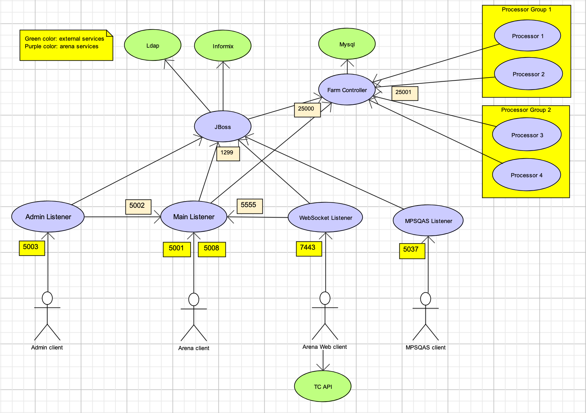

## Arena architecture

### JBoss

JBoss hosts EJBs which access Ldap/Informix/Mysql. It uses 1299 port to handle EJB invocations from Listeners.

### Listeners

There are 4 listeners:

- Main Listener handles arena client requests at 5001 port. **The 5001 port is exposed to external.**
  - It will connect tc-api to generate code image when coder challenges others.
- Admin Listener handles admin client requests at 5003 port.**The 5003 port is exposed to external.**
  - It will pass some of these admin requests to 5002 port of Main Listener . For example, assuming admin wants to ban the IP of an arena client, this admin request is first sent to Admin Listener on 5003 port, then passed to Main Listener on 5002 port, then Main Listener will configure itself to ban this IP from arena client.
- WebSocket Listener handles arena web client requests at 5016 port.**The 5016 port is exposed to external.**
  - It will pass all theses WebSocket requests to 5555 port of Main Listener, since it's a wrapper using WebSocket protocol.
  - Besides using WebSocket requests, the arena web client also sends some request to tc-api, like to get SRM schedule.
- MPSQAS Listener handles MPSQAS client requests at 5037 port.**The 5037 port is exposed to external.**

### SQS Queues

- The SQS is an AWS SQS service. Its endpoint is configured using Java system property `-Darena.sqs-endpoint`

- There are two kind of queues: request queues and result queues.

  - There are multiple request queues configured in Mysql table `FARM_QUEUE_CONFIG`. E.g. for compile there is `compile` queue; for SRM test there is `srm-test` queue; for MM test there is `mm-test` queue.
  - Both JBoss & Main Listener will send messages to request queues for compile/test .
  - Farm Processors monitor request queues (configured using Java system property `-Darena.processor-queues`). It pulls request messages from monitored queues, then process the compile/test and send result messages to result queues.
  - There are 2 result queues:
    - JBoss monitors `proc-results` result queue for the processed compile/test result.
    - Main Listener monitors `listener-results` result queue for the processed compile/test result.

  

- Notice the actual queue name in AWS SQS will be `"<env>" + "ArenaCode-" + "<queueName>"`. The `"<env>"` value is configured using Java system property `-Darena.env-prefix`. For example:

  - For `compile` queue, the actule queue name in AWS SQS is `devArenaCode-compile` for dev env, and `prodArenaCode-compile` for prod env.
  - For `srm-test` queue, the actule queue name in AWS SQS is `devArenaCode-srm-test` for dev env, and `prodArenaCode-srm-test` for prod env.
  - For `proc-results` queue, the actule queue name in AWS SQS is `devArenaCode-proc-results` for dev env, and `prodArenaCode-proc-results` for prod env.

### Deploy Suggestion

- JBoss and those 4 Listeners could be deployed togher within same host/container to avoid network latency.
- Multiple Farm Processors can be deployed. For example, for each distinct queue name in `FARM_QUEUE_CONFIG` table, deploy a dedicated Farm Processor for it (using  `-Darena.processor-queues=<queueName>`). Refer to [tc-deploy.md](./tc-deploy.md) for details.