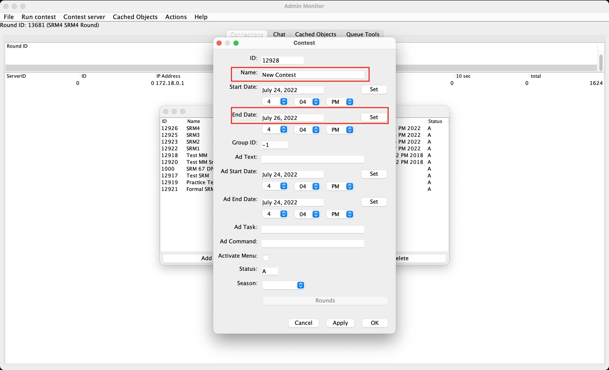
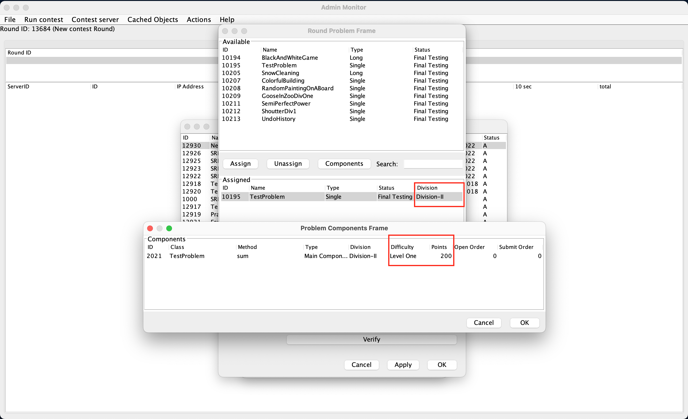
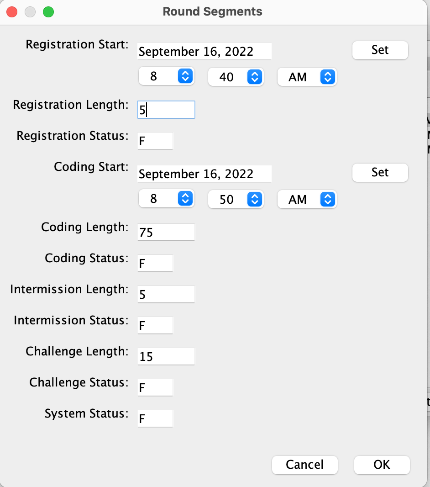
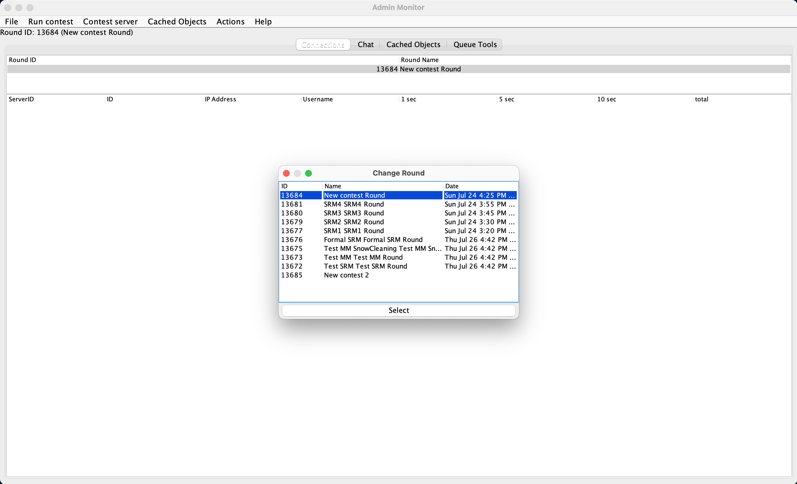
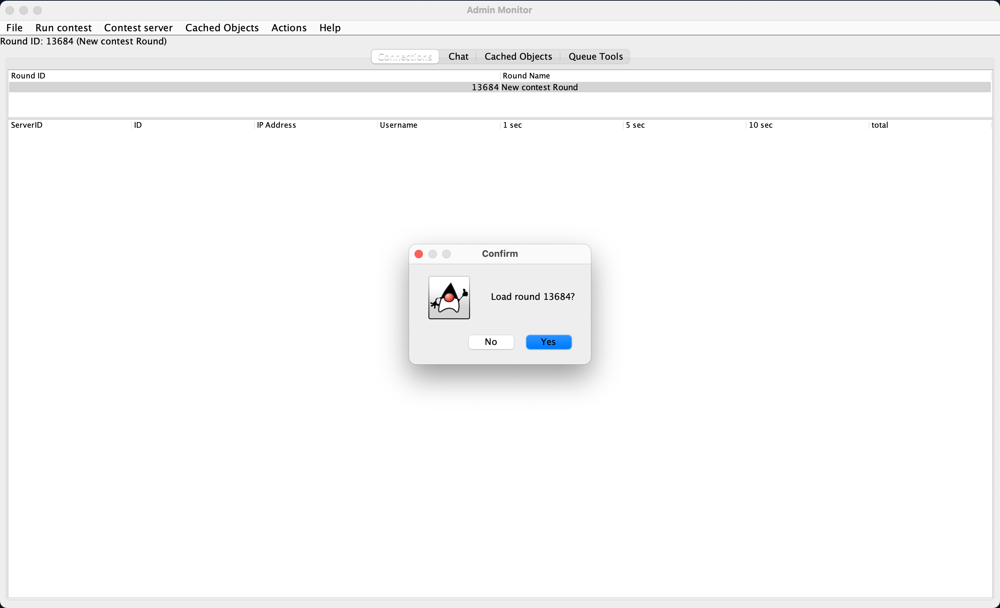
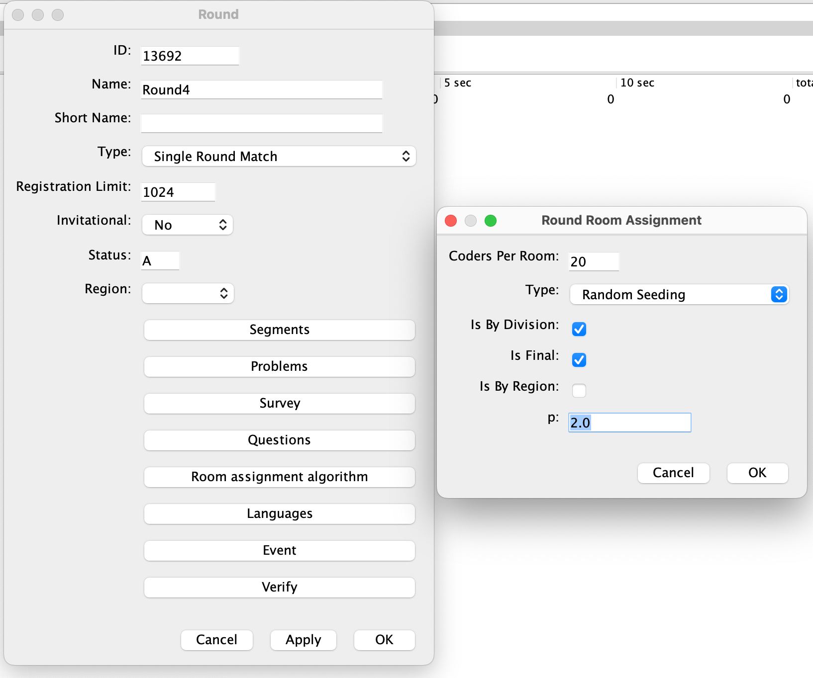
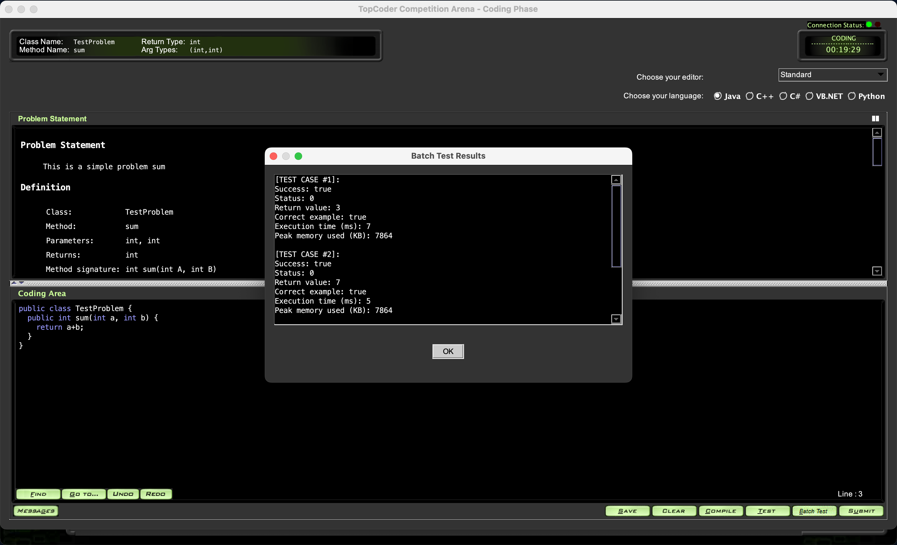

## Client Verification

### Verify MPSQAS client:

Refer to https://youtu.be/Tdq16Pn8IsU for details.

### Verify Admin client & Arena client:

1. Login to admin client, create a contest, refer to https://youtu.be/L02CgpOqJE0 for details

   - When create contest, enter **Name**, set the **End Date** to 2 days later

     

   - When assign round problems, need set **Division**, **Difficulty** and **Points**:

     

   - When set round segments, set following values:

     ```properties
      Registration Start = {current_time} + 5 minutes
      Registration Length = 5
      Coding Start = {current_time} + 10 minutes
     ```

     

   - Then click menu **File -> Load Round Access** and select the round you just created:

     

   - Then click menu **Run contest -> Before contest -> Load round**, then click **Yes** button:

     

2. After about 5 minutes the Registration phase starts. Login to arena client and register to contest, refer to https://youtu.be/k0nfujuWQtI for details

3. After coder registered, use admin client to assign rooms, refer to https://youtu.be/wSBfo1nuLek for details:

   ```properties
   Coders Per Room = 20
   Type = Random Seeding
   Is By Division = false
   Is Final = true
   Is By Region = false
   p = 2.0
   ```

   

4. After about 10 minutes the Coding phase starts. Use arena client to enter room and compete, refer to https://youtu.be/qT8fjyc4__M for details:

   

