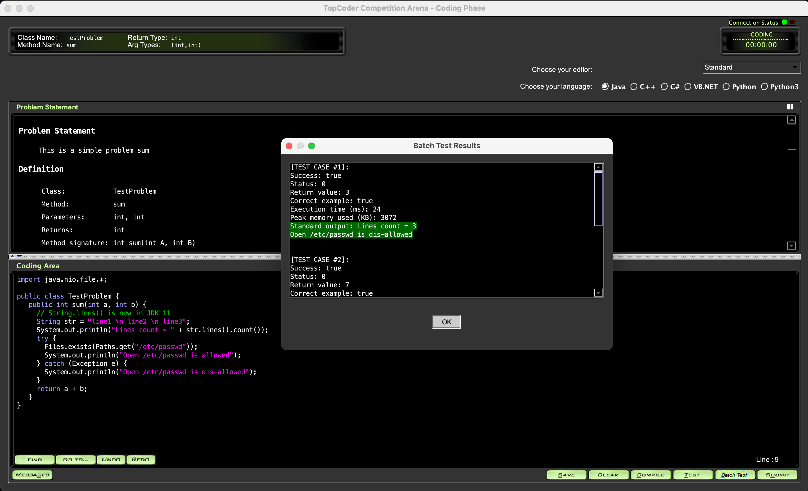

## Client Verification

### Verify MPSQAS client:

Refer to https://youtu.be/Tdq16Pn8IsU for details.

### Verify Admin client & Arena client:

1. Login to admin client, create a contest, refer to https://youtu.be/L02CgpOqJE0 for details

   - When create contest, enter **Name**, set the **End Date** to 2 days later

     

   - When assign round problems, need set **Division**, **Difficulty** and **Points**:

     

   - When set round segments, set following values:

     ```properties
      Registration Start = {current_time} + 5 minutes
      Registration Length = 5
      Coding Start = {current_time} + 15 minutes
     ```

     **Ensure [Coding Start] time to be later (several minutes) than [Registration Start] + [Registration Length]**

     

   - Then click "Room assignment algorithm" button:

     ```properties
     Coders Per Room = 20
     Type = Random Seeding
     Is By Division = true
     Is Final = true
     Is By Region = false
     p = 2.0
     ```

     

   - Then click menu **File -> Load Round Access** and select the round you just created:

     

   - Then click menu **Run contest -> Before contest -> Load round**, then click **Yes** button:

     

2. After about 5 minutes the Registration phase starts. Login to arena client and register to contest, refer to https://youtu.be/k0nfujuWQtI for details

4. After about 15 minutes the Coding phase starts. Use arena client to enter room and compete, refer to https://youtu.be/4RoU7hYQO6o for details:

   - Verify Java, notice the `str.lines()` is new in JDK 11, and `/etc/passwd` is disallowed to open:

   

   - Verify C++, notice the `(args + ...)` is new in C++17, and `/etc/passwd` is disallowed to open:

   

   - Verify Python3, notice the `super()` is new in Python3, and `/etc/passwd` is disallowed to open:

   

4. Use admin client to **End contest**, **Run ratings** and **Insert practice room**:

   

   

   

   

5. After **Insert Practice Room**, then click “**Refresh Room Lists…**” to refresh practice rooms:

   


