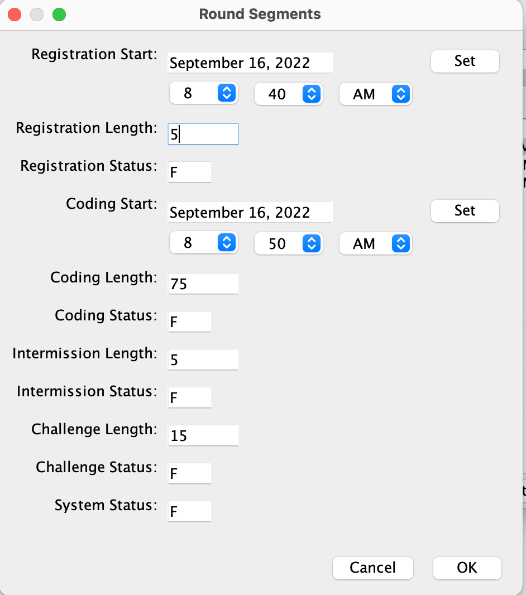

## Local Docker Deployment

### Prerequisites

  - Docker
  - [Github account with SSH key configured](https://docs.github.com/en/authentication/connecting-to-github-with-ssh/adding-a-new-ssh-key-to-your-github-account)

### Start Docker Containers

```bash
# Goto docker folder
cd docker

# Start docker containers
docker-compose up -d

# View docker logs, when you see below logs then containers are started succcessfully
# arena-mysql       | 2022-07-23T12:25:07.651734Z 0 [Note] mysqld: ready for connections.
# arena-ldap        | Starting slapd: [  OK  ]
# arena-informix    | *** Startup of informixoltp_tcp SUCCESS ***
docker-compose logs -f
```


The informix docker is a bit outdated, need fix db schema:

```bash
# Login to arena-informix containter
docker exec -it arena-informix bash

# Fix db schema
echo "ALTER TABLE round_room_assignment ADD short_name varchar(100)" | dbaccess informixoltp@informixoltp_tcp

# Exit from arena-informix containter
exit
```


### Build & Start Arena Services

```bash
# Checkout Github repos 
# Note your Github account need be configured with SSH key
# Replace "/path-to-ssh-private-key" to your actual path of SSH private key
docker exec -it arena-app bash /home/apps/docker/checkout.sh "$(cat /path-to-ssh-private-key)"

# Build arena services, will take several minutes
docker exec -it arena-app bash /home/apps/docker/build.sh

# Start arena services, will take several minutes, when you see "Startup Complete" then it's finished
docker exec -it arena-app bash -c "cd /home/apps/dev/arena-vm && ./start-services.sh"
```


### Start Clients

At first add `127.0.0.1 tc.cloud.topcoder.com` to your hosts.

Start mpsqas client:

```bash
# Copy built mpsqas client from docker
docker cp arena-app:/home/apps/dev/comp-eng/mpsqas-client/build/mpsqas-client-7.1.1.zip .

# Unzip
unzip mpsqas-client-7.1.1.zip -d mpsqas-client

# Run mpsqas client
cd mpsqas-client
sh mpsqas.sh

# Then login with lightspeed/password
```

Start admin client:

```bash
# Copy built admin client from docker
docker cp arena-app:/home/apps/dev/app/dist/admin-client-7.1.5.zip .

# Unzip
unzip admin-client-7.1.5.zip -d admin-client

# Run admin client
cd admin-client
sh admin.sh

# Then login with heffan/password
```

Start arena client:

```bash
# Copy built arena client from docker
docker cp arena-app:/home/apps/dev/comp-eng/arena-client/build/arena-client-7.1.3.zip .

# Unzip
unzip arena-client-7.1.3.zip -d arena-client

# Run arena client
cd arena-client
sh arena.sh

# Then login with twight/password
```


**NOTE: the latest built arena client has error when login to TopCoder production server, this is due to [UserInfo class is changed](https://github.com/appirio-tech/compeng-common/commit/e4e1939b5362c8af04cb218a784692a0e66ba298)  by adding an `admin4Web` field, but not yet deployed in production. So when arena client [reads the UserInfo](https://github.com/appirio-tech/compeng-common/blob/dev/src/main/com/topcoder/netCommon/contestantMessages/UserInfo.java#L208) object, it expects the `admin4Web` field, but is not sent from production server.**


### Verify MPSQAS client:

Refer to https://youtu.be/Tdq16Pn8IsU for details.


### Verify Admin client & Arena client:

1. Login to admin client, create a contest, refer to https://youtu.be/L02CgpOqJE0 for details

  - When create contest, enter **Name**, set the **End Date** to 2 days later

    

  - When assign round problems, need set **Division**, **Difficulty** and **Points**:

    

  - When set round segments, set following values:

    ```properties
     Registration Start = {current_time} + 5 minutes
     Registration Length = 5
     Coding Start = {current_time} + 10 minutes
    ```

    

  - Then click menu **File -> Load Round Access** and select the round you just created:

    

  - Then click menu **Run contest -> Before contest -> Load round**, then click **Yes** button:

    

2. After about 5 minutes the Registration phase starts. Login to arena client and register to contest, refer to https://youtu.be/k0nfujuWQtI for details

3. After coder registered, use admin client to assign rooms, refer to https://youtu.be/wSBfo1nuLek for details:

  ```properties
  Coders Per Room = 20
  Type = Random Seeding
  Is By Division = false
  Is Final = true
  Is By Region = false
  p = 2.0
  ```

  

4. After about 10 minutes the Coding phase starts. Use arena client to enter room and compete, refer to https://youtu.be/qT8fjyc4__M for details:

  


### Files changed

Refer to `docker/checkout.sh` for the file changes:

- `app/ivy.xml`:
  - change `spring-context` version from `4.1.0.RELEASE` to `5.3.22`
- `app/token.properties`:
  - change informix host to docker container name `arena-informix`
  - change mysql host to docker container name `arena-mysql`
  - change ldap host to docker container name `arena-ldap`
  - change `datawarehouse_tcp` to `informixoltp_tcp` regard to informix docker
- `farm-server/ivy.xml`:
  - add `commons-codec` and `aws-java-sdk` dependencies
- `farm-server/src/scripts/processor.sh`:
  - add `sleep 10` to wait for processor to start
- `glue/settings/ivysettings-public.xml`:
  - set public root to `https://repo1.maven.org/maven2` 
- `glue/settings/ivysettings-default-chain.xml`:
  - remove `<ibiblio name="ibiblio" m2compatible="true" root="http://maven.appirio.net:8080" />` line
- `arena-vm/elasticmq-server.conf`:
  - change `sqs.topcoder.com` to `localhost`
- `arena-vm/start-farm-processor.sh`:
  - change `sqs.topcoder.com` to `localhost`
- `arena-vm/start-sqs-service.sh`:
  - use `nohup` to run `elasticmq-server`
- `arena-vm/TC.cloud.ldap.keystore`:
  - created using `TC_PROD_CA.pem` from `appiriodevops/ldap` docker image

